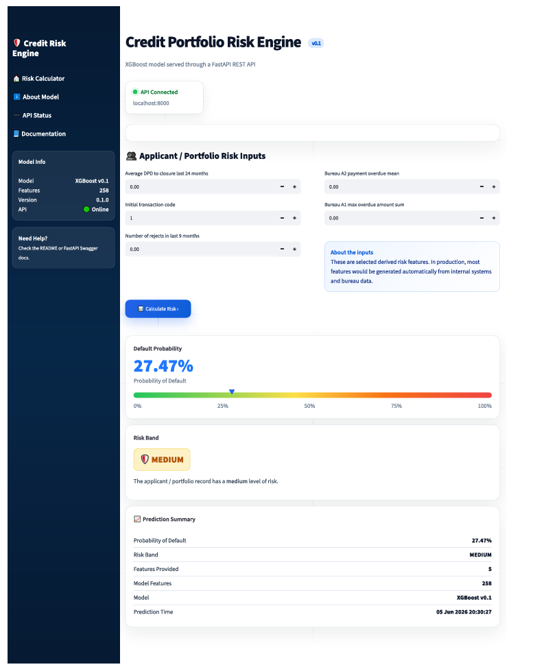

# Credit Portfolio Risk Engine

End-to-end credit risk scoring application built with:

* XGBoost
* FastAPI
* Streamlit
* MLflow
* Docker

---

## Project Overview

This project demonstrates the development of an end-to-end credit risk data product.

Starting from raw credit portfolio data, the solution performs feature engineering, trains and evaluates machine learning models, tracks experiments with MLflow, serves predictions through a FastAPI REST API and exposes a business-friendly Streamlit dashboard.

The objective is to estimate Probability of Default (PD) for credit applicants or existing portfolio customers while showcasing the full lifecycle of a modern machine learning solution.

The project focuses on practical data science and machine learning engineering concepts, including:

* Feature engineering
* Model experimentation
* Model selection
* Experiment tracking
* API development
* Dashboard development
* Containerization
* End-to-end deployment

Version 0.1 follows an experimentation-first approach, allowing feature groups and data sources to be evaluated incrementally before moving toward a production-grade architecture.

---

## Architecture

```text
Raw Data
    │
    ▼
Feature Engineering
    │
    ▼
XGBoost Training
    │
    ▼
MLflow Tracking
    │
    ▼
FastAPI REST API
    │
    ▼
Streamlit Dashboard
```

---

## Application Preview



---

## Experimentation Journey

Version 0.1 was intentionally built as an experimentation-focused release.

Instead of building a fully optimized production pipeline from day one, feature blocks were added incrementally to understand their contribution to model performance and business value.

The workflow followed:

1. Static application features
2. Person-level aggregates
3. Previous application features
4. Bureau B aggregates
5. Bureau A1 lightweight features
6. Bureau A2 lightweight features

Each feature block was merged, validated, and evaluated independently before moving to the next stage.

This approach improved explainability of the development process and made it easier to identify which data sources contributed the most predictive power.

The largest performance improvements came from Bureau A1 and Bureau A2 delinquency-related features, particularly overdue amount and payment delay aggregates.

---

## Final Model

Algorithm:

* XGBoost Classifier

Dataset size:

* ~1.5 million observations

Feature count:

* 258 engineered features

Performance:

| Metric          | Value |
| --------------- | ----- |
| Validation AUC  | 0.824 |
| Validation Gini | 0.648 |

---

## Technologies

### Machine Learning

* XGBoost
* Scikit-Learn
* Pandas
* NumPy

### Serving

* FastAPI
* Swagger UI
* Uvicorn

### Front-End

* Streamlit

### MLOps

* MLflow
* Docker

---

## API

Start FastAPI:

```bash
uvicorn api.main:app --reload
```

Swagger Documentation:

```text
http://localhost:8000/docs
```

Example API Workflow:

```text
Applicant Data
      │
      ▼
POST /predict
      │
      ▼
Probability of Default
      │
      ▼
Risk Band
```

---

## Streamlit Dashboard

Run locally:

```bash
streamlit run app_streamlit/app.py
```

The dashboard communicates with the FastAPI backend and provides a simple business-facing interface for risk scoring.

---

## MLflow Experiment Tracking

Launch MLflow UI:

```bash
mlflow ui
```

Open:

```text
http://localhost:5000
```

MLflow is used to track:

* Validation metrics
* Model versions
* Feature counts
* Experiment metadata

---

## Docker

Build and run:

```bash
docker compose up --build
```

---

## Artifact Policy

Large local artifacts are intentionally excluded from Git:

* Raw datasets
* Processed parquet files
* Trained model binaries
* MLflow databases
* MLflow run artifacts

To reproduce the project, execute the scripts inside the `scripts/` directory.

---

## Current Scope

Version 0.1 focuses on:

* Local experimentation
* Feature engineering
* Model comparison
* API deployment
* Dashboard deployment
* MLflow integration

The primary goal was to understand the end-to-end workflow before investing in production-grade optimization.

---

## Roadmap

### Version 1.0

Planned improvements:

* Hyperparameter optimization
* SHAP explainability
* Model monitoring
* Drift detection
* Automated retraining
* CI/CD pipeline
* Cloud deployment
* Production-grade feature pipelines
* Enhanced Streamlit user experience